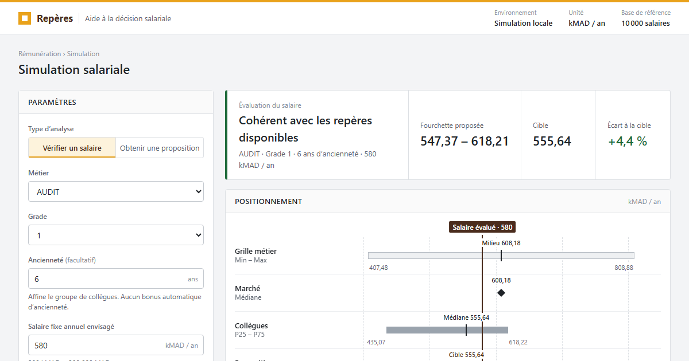

# Aide à la décision salariale

Deux modes : **vérifier un salaire** et **obtenir une proposition**.



## Démarrer

Depuis la racine du projet, dans PowerShell :

```powershell
.\.venv\Scripts\python.exe -m decision_support.app
```

Ouvrir **http://127.0.0.1:8765**. Arrêter avec `Ctrl+C`.
Si le port est occupé, ajouter `--port 8766`. Aucune dépendance supplémentaire n'est nécessaire.

## Utilisation

1. Choisir le mode, le métier et le grade.
2. Renseigner l'ancienneté si une comparaison plus fine est souhaitée.
3. Pour vérifier un salaire, saisir le montant annuel en **kMAD** : 200 signifie 200 000 MAD.
4. Pour un salarié existant, saisir son matricule afin de l'exclure des pairs.
5. Consulter les comparaisons et, si disponible, la fourchette et la cible indicative.

## Lire le résultat

Chaque chiffre n'apparaît qu'à un seul endroit :

- **Bandeau de synthèse** : verdict (cohérent, points à examiner dès qu'une des quatre règles se déclenche, références incomplètes), fourchette proposée et cible. En vérification, il donne aussi l'écart du salaire à la cible, en % ; en proposition, le CompaRatio de la cible.
- **Positionnement** : une règle place sur la même échelle la grille (min–max et milieu), la médiane du marché, les collègues (P25–P75 et médiane), la fourchette proposée et, en vérification, le salaire évalué (trait brun). Les montants sont écrits sur les barres. Une phrase indique le nombre de collègues comparés et le périmètre retenu.

Aucun profil saisi n'est enregistré sur le serveur. Les fichiers d'entrée ne sont pas modifiés.

Les couleurs de marque sont regroupées en haut de `static/style.css` (`--brand`, `--brand-soft`, `--brand-dark`) pour être ajustées à la charte officielle.

## Références utilisées

- `input/bands.csv` : ligne exacte **métier + grade**. Les grilles de métiers différents ne sont jamais mélangées.
- `input/market.csv` : médiane du même métier et grade. Le fichier peut être absent.
- `input/employes.csv` : les collègues, choisis comme dans `src/anomaly_cohortes.py` : même grade + même métier + même tranche d'ancienneté, sinon même grade + même métier, sinon même grade seul (tous métiers). Le premier groupe qui compte au moins `cohort_min_size` collègues est retenu. Sans ancienneté saisie, le premier niveau est sauté.
- `config/rules.yaml` : seuils des quatre règles (grille, CompaRatio, marché, écart entre pairs), effectif minimal et groupes de collègues.

Les montants sont en **kMAD par an**, comme dans les fichiers d'entrée.

Les sources sont chargées au démarrage. **Redémarrer après une modification.**

L'âge, le sexe, les compétences, le 9Box et Hot job ne déterminent pas le montant dans cette première version. Aucun coefficient supplémentaire n'est inventé. L'ancienneté affine la comparaison, sans majoration automatique.

## Méthode de proposition

La fourchette est l'intersection de la bande interne, de l'intervalle autorisé par le CompaRatio, des tolérances du marché et, si l'effectif suffit, des quartiles P25–P75 des pairs. Elle reste aussi en deçà du seuil d'alerte entre pairs. La cible est leur médiane, ramenée dans cette fourchette. Sans pairs suffisants, le milieu de grille sert de cible et la référence est signalée comme incomplète.

Les bornes sont arrondies vers l'intérieur à deux décimales. La cible est revérifiée par le mode évaluation. Les seules différences d'arrondi informatique aux seuils sont neutralisées.

Une grille absente ou invalide empêche la proposition. Des repères incompatibles ne donnent aucune fourchette (verdict « Points à examiner ») plutôt qu'un montant inventé. Comme dans `src/anomaly_pretraitement.py`, un matricule en double, ou un métier + grade en double dans la grille ou le marché, garde sa première ligne. Un matricule inconnu est rejeté.

Le mode évaluation applique les quatre règles de `src/anomaly_regles.py`, avec les seuils de `config/rules.yaml` : comme dans le programme principal, un salaire à peine au-delà du Min ou du Max reste dans la marge tolérée. Le salaire envisagé n'est jamais ajouté aux références. L'écart entre pairs est calculé comme PeerZ dans `src/anomaly_cohortes.py`, mais sur les collègues seuls.

La moitié centrale des pairs sert à construire une proposition. Être en dehors de cette moitié ne déclenche pas à lui seul une alerte : l'évaluation utilise le seuil d'écart entre pairs.

## Portée de cette version

Cette version utilise des comparaisons explicites. Elle ne relance ni l'Isolation Forest ni la régression à chaque saisie, et ne calcule pas de score général : seules les règles sont appliquées.

La proposition est un **repère de discussion à valider**, pas un salaire optimal démontré. Dans le jeu actuel, le marché et le milieu de grille sont identiques : ce ne sont pas deux repères indépendants. Les données du projet doivent être confirmées comme références métier avant un usage opérationnel.

L'application écoute uniquement sur l'ordinateur local. Elle n'est pas un service multi-utilisateur déployé.
